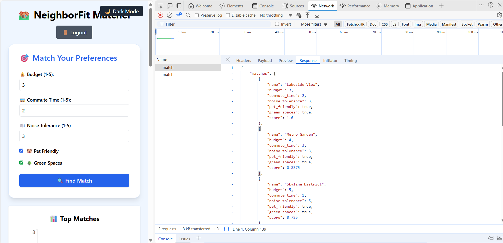
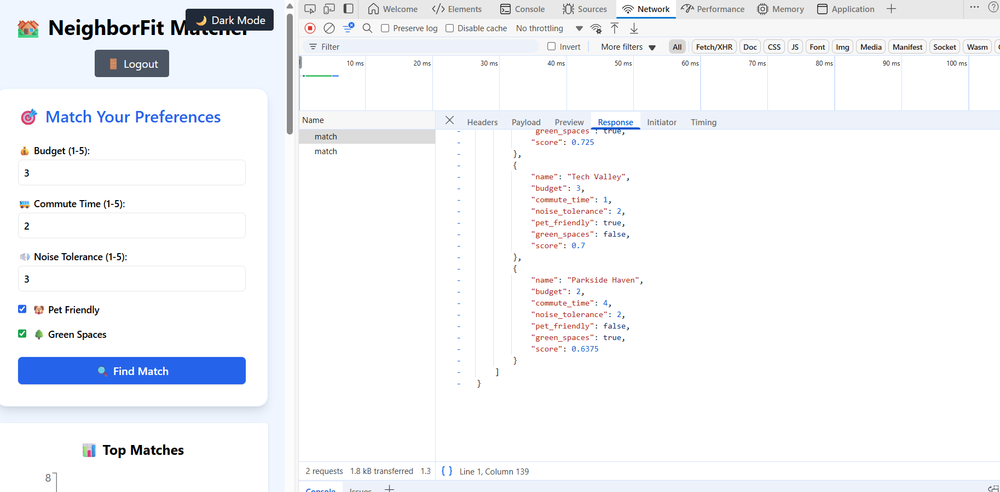

# 🏘️ NeighborFit – Lifestyle-Based Neighborhood Matching App

NeighborFit is a full-stack web application that intelligently matches users with neighborhoods based on lifestyle preferences such as budget, commute time, noise tolerance, pet-friendliness, and access to green spaces.

---

## 🚀 Features

- 🔐 Secure Login & Registration (JWT-based)
- 📊 Lifestyle-Based Matching Algorithm
- 📍 Visual Insights with Bar & Pie Charts
- 🏞️ Exportable Reports (PDF & CSV)
- 🌗 Dark Mode Support
- ⚡ Fast, Lightweight, and Responsive

---

## 📁 Project Structure

Neighborfit/
│
├── backend/
│ └── app/
│ ├── main.py # FastAPI server entrypoint
│ ├── match.py # Matching logic
│ ├── data.py # Neighborhood data
│ ├── algorithm.py # Scoring logic
│ ├── auth.py # Auth endpoints
│ ├── users.py # In-memory user db
│ ├── routes.py # Route definitions
│
├── frontend/
│ └── src/
│ ├── App.js # Main React App
│ ├── index.css # TailwindCSS styles
│
├── docs/ # Supporting documentation
│ ├── sample-match-response.json
│ ├── sample-match-response-1.png
│ └── sample-match-response-2.png
└── README.md

yaml
Copy
Edit

---

## ⚙️ Tech Stack

| Layer      | Technology                        |
|------------|-----------------------------------|
| Frontend   | ReactJS, TailwindCSS, Recharts    |
| Backend    | FastAPI (Python), JWT (jose), bcrypt |
| Export     | jsPDF, react-csv                  |
| State Mgmt | React Hooks                       |

---

## 🧪 Testing Highlights

- ✅ Verified matching accuracy using diverse edge cases
- ✅ Tested login/register flows with multiple users
- ✅ Chart rendering and data export validated
- ✅ Handles missing/partial data with fallback logic

---

## 🛠️ Local Development Setup

### 🔧 Backend (FastAPI)

```bash
cd backend
python -m venv venv
venv\Scripts\activate  # On Windows
pip install -r requirements.txt
uvicorn app.main:app --reload
🖥️ Frontend (ReactJS)
bash
Copy
Edit
cd frontend
npm install
npm start
Access frontend at: http://localhost:3000

✅ Live Backend API (FastAPI)
Base URL: https://neighborfit-production.up.railway.app

Available Endpoints:
GET / → Health check (returns "NeighborFit Backend is Running 🚀")

POST /register → Register a new user

POST /login → Login with username/password (returns JWT token)

POST /match → Submit preferences and receive matched neighborhoods

📊 Sample /match Response
📁 JSON file: sample-match-response.json

🖼️ Screenshot Preview

| Screenshot 1 | Screenshot 2 |
|--------------|--------------|
|  |  |


📦 Deployment
🔧 Backend: Railway - FastAPI Deployment
